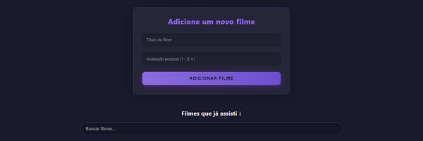

# Watched Movies Project



## 🎬 Sobre o Projeto

O "Watched Movies Project" é uma aplicação web completa, construída com React no frontend e Spring Boot no backend, que permite aos usuários registrar e gerenciar filmes que já assistiram. A aplicação utiliza a API do [The Movie Database (TMDb)](https://www.themoviedb.org/) para buscar informações detalhadas sobre os filmes, como título, ano de lançamento, sinopse, gênero e pôster.

A ideia central é criar uma lista pessoal de filmes, onde é possível adicionar novos títulos, atribuir uma nota de 1 a 5, e gerenciar a lista com funções de edição e exclusão.

---

## 🛠️ Tecnologias Utilizadas

### Frontend (React)

- **React:** Biblioteca JavaScript para construir interfaces de usuário.
- **Axios:** Cliente HTTP para fazer requisições à API do backend.
- **Lucide React:** Biblioteca de ícones para uma interface mais intuitiva.
- **CSS:** Estilização da aplicação.
- **Postman:** Utilizado para testar e validar os endpoints da API REST do backend.

### Backend (Spring Boot)

- **Spring Boot:** Framework Java para criar aplicações robustas e escaláveis.
- **Spring Data JPA:** Facilita a interação com o banco de dados.
- **Lombok:** Reduz o código repetitivo (boilerplate) com anotações.
- **H2 Database:** Banco de dados em memória para desenvolvimento.
- **REST Template:** Utilizado para fazer requisições à API do TMDb.

---

## 🚀 Como Rodar o Projeto

### 1. Pré-requisitos

Certifique-se de ter as seguintes ferramentas instaladas:

- [Java Development Kit (JDK) 17 ou superior](https://www.oracle.com/java/technologies/downloads/)
- [Maven](https://maven.apache.org/download.cgi)
- [Node.js e npm](https://nodejs.org/en/download/)
- [Git](https://git-scm.com/downloads)

### 2. Configuração do Backend

1.  **Clone o repositório:**
    ```bash
    git clone https://github.com/sybzinha/watched-movies-project.git
    cd watched-movies-project/watched-movies-api
    ```
2.  **Obtenha a chave da API do TMDb:**
    - Crie uma conta no [TMDb](https://www.themoviedb.org/).
    - Em `Configurações > API`, gere uma nova chave de API.
3.  **Configurar o `application.properties`:**
    - Dentro da pasta `watched-movies-api/src/main/resources`, crie um arquivo chamado `application.properties`.
    - Adicione a sua chave de API ao arquivo:
      ```properties
      tmdb.api.key=[SUA_CHAVE_AQUI]
      ```
4.  **Inicie o backend:**
    Abra a pasta do backend em sua IDE (IntelliJ, por exemplo) e execute a classe principal `Main.java` ou use o terminal:
    ```bash
    ./mvnw spring-boot:run
    ```

### 3. Configuração do Frontend

1.  **Navegue até a pasta do frontend:**
    ```bash
    cd ../watched-movies-frontend
    ```
2.  **Instale as dependências:**
    ```bash
    npm install
    ```
3.  **Inicie o frontend:**
    ```bash
    npm start
    ```

---

## 📸 Imagens da Aplicação

### API REST com Postman

Aqui está um exemplo de como a API se comporta, com uma requisição feita através do Postman.


_Exemplo: Requisição GET para listar todos os filmes, com o retorno em JSON._


---

<p align="center">
  Desenvolvido com ❤️ por <a href="https://github.com/sybzinha">sybzinha</a>
</p>
